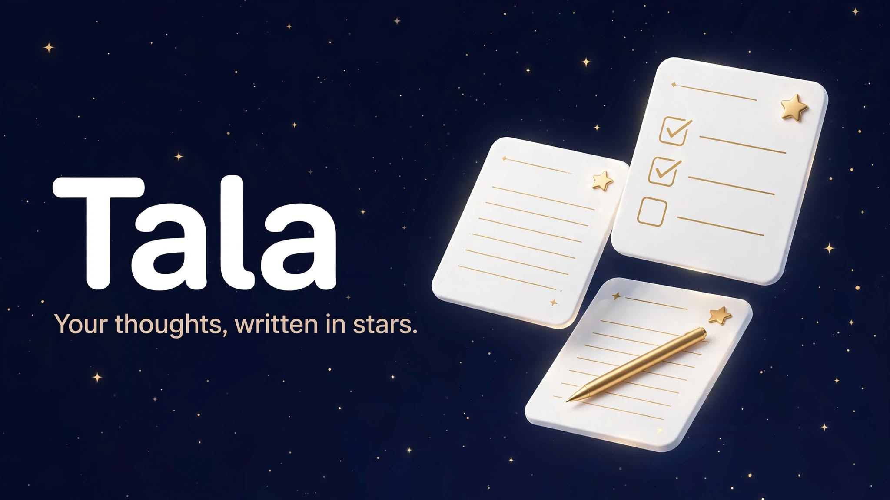

<p align="center">
  
</p>

<h1 align="center">Tala</h1>

<p align="center">
  <strong>Pagtatala, made simple.</strong><br/>
  A thoughtful, doodle-inspired note-taking workspace for capturing ideas, thoughts, and everything worth remembering.
</p>

<p align="center">
  <a href="https://github.com/E1yWrites/tala/releases/latest"></a>
  <a href="https://github.com/E1yWrites/tala/blob/main/LICENSE"></a>
  <a href="https://github.com/E1yWrites/tala"></a>
</p>

---

No account, no server, no tracking. Your notes work offline and stay on your device
until *you* export them — in the browser or as a native desktop app.

---

## Download

Pre-built installers are available on the [Releases](https://github.com/E1yWrites/tala/releases/latest) page.

### Windows

| Format | File | Best for |
| --- | --- | --- |
| .exe (NSIS) | `Tala_1.0.0_x64-setup.exe` | Standard Windows installer |
| .msi | `Tala_1.0.0_x64_en-US.msi` | Enterprise / silent install (`msiexec /i`) |

### Linux

| Format | File | Best for |
| --- | --- | --- |
| AppImage | `Tala_1.0.0_amd64.AppImage` | Any Linux distro (no install needed) |
| .deb | `Tala_1.0.0_amd64.deb` | Debian, Ubuntu, Pop!_OS, Linux Mint |
| .rpm | `Tala-1.0.0-1.x86_64.rpm` | Fedora, RHEL, openSUSE |

### Verify your download

Each release includes SHA-256 checksums. After downloading, verify file integrity:

```bash
# Download the checksum file from the release page, then:
sha256sum -c SHA256SUMS
```

Or verify a single file manually:

```bash
sha256sum Tala_1.0.0_x64-setup.exe
# Compare the output hash against the one listed in SHA256SUMS
```

> **Note:** The installers are not code-signed. Verify the SHA-256 checksum to confirm the file has not been tampered with.

---

## Quick start (development)

```bash
git clone https://github.com/E1yWrites/tala.git
cd tala
npm install
npm run dev        # start dev server (http://localhost:5173)
npm run build      # typecheck + production build → dist/
npm run preview    # serve the production build (http://localhost:4173)
npm run typecheck  # tsc --noEmit
```

## Desktop app (Tauri v2)

The same web app wrapped in a native shell (system WebKitGTK on Linux, WebView2 on Windows — no bundled Chromium).
Notes persist in the webview's IndexedDB profile keyed by the `com.lanz.tala` identifier.

```bash
# one-time prerequisites (Debian/Ubuntu)
sudo apt install libwebkit2gtk-4.1-dev build-essential curl wget file \
  libxdo-dev libssl-dev libayatana-appindicator3-dev librsvg2-dev
curl --proto '=https' --tlsv1.2 -sSf https://sh.rustup.rs | sh

npm run app:dev     # native window with HMR (starts vite itself)
npm run app:build   # typecheck + build + release compile → installers
```

Build artifacts land in `src-tauri/target/release/bundle/`:
`.deb`, `.rpm` and `.AppImage` (Linux); `.exe` and `.msi` (Windows).

---

## Features

- **Dashboard home** — greeting, live stats, quick actions, pinned & recently-edited rows
- **Rich editor** — headings, lists (incl. checkboxes), quotes, code blocks with copy,
  links, images (upload / paste / drag), inline markdown as you type, word count, saved indicator
- **Templates** — lecture notes, meeting notes, to-do list, journal, brain dump, code notes...
- **Adaptive toolbar** — one calm row that follows what you're doing: text formatting while typing,
  pen · eraser · lasso · undo while drawing, contextual actions (duplicate, cut/copy/paste, rotate,
  recolour, delete) while ink is selected
- **Draw popover** — every handwriting control in one place: pen / pencil / highlighter / eraser / lasso,
  six presets (Marker, Brush Pen, Ballpoint, Pencil, Fine Pencil, Highlighter), colours, sizes,
  opacity, recently used combinations, stylus settings
- **Apple Pencil & stylus** — pressure-sensitive width, tilt shading for the pencil, hover preview of the
  next mark, palm rejection, finger draws-or-scrolls; double-tap / squeeze actions are configurable
  when a native bridge exposes them (Safari doesn't)
- **iPad / touch** — a draggable floating pen tray that fades while you write
- **Multi-select** — batch trash, delete forever, and selection across all surfaces (live, archive, trash)
- **Long-press preview** — floating card with note metadata, tags, task progress, and quick actions
- **Organize** — folders, colored tags, favorites, pins, archive; sort & density controls;
  grid or list layout; filter by tag / favorites
- **Instant search** — spotlight modal over titles, body text, tags and folders with highlighting
- **Command palette** (`Ctrl+Shift+P`) — jump anywhere, run any action
- **Trash with restore** — soft-delete notes or the whole trash; archive is one keystroke away
- **Distraction-free mode** — collapse everything but the editor
- **Light / dark / auto theme**, persisted before first paint (no flash)
- **Responsive** — three-pane desktop → drawer tablet → single-pane mobile with bottom nav
- **Keyboard-first** — see below
- **Data ownership** — export/import JSON backups (merge or replace), storage usage readout
- **Animated theme toggle** — sun ↔ moon with smooth CSS transitions
- **Doodle-inspired brand** — playful, personal, modern

### Keyboard shortcuts

| Keys | Action |
| --- | --- |
| `Ctrl/Command N` / `Alt N` | New note (template picker) |
| `Ctrl/Command K` / `Ctrl/Command Shift F` | Search notes |
| `Ctrl/Command Shift P` | Command palette |
| `Ctrl/Command S` | Force save |
| `Ctrl/Command Shift D` | Toggle dark mode |
| `Ctrl/Command ,` | Settings |
| `/` | Focus list search |
| `Ctrl/Command .` | Toggle drawing in the open note |
| `Esc` | Close dialog / exit focus mode / exit multi-select / stop drawing |
| `Ctrl B` / `I` / `U` | Bold / italic / underline |
| `1` / `2` / `3` · `E` · `L` | While drawing: pen / pencil / highlighter · eraser · lasso |
| `[` / `]` | While drawing: thinner / thicker stroke |
| `Ctrl C` / `X` / `V` / `D` | Selected ink: copy / cut / paste / duplicate |

*(Some browsers reserve `Ctrl N`; use `Alt N` there.)*

---

## Architecture

```
src/
+-- components/
|   +-- Brand/                    # TalaMark SVG logo
|   +-- Dashboard/HomeView        # stats, pinned/recent rows, quick actions
|   +-- Modals/*                  # template picker, spotlight search, palette, share...
|   +-- NoteEditor/*              # Tiptap setup, adaptive toolbar, ink layer, Draw popover, floating touch tray
|   +-- NoteList/*                # list/grid panel, rows, per-note menus, preview card
|   +-- Sidebar/                  # nav tree, folders, tags, collapse, profile
|   +-- UI/                       # Button, Modal, DropdownMenu, Tooltip, TagChip, ThemeToggle...
|   +-- layout/                   # AppShell (responsive panes), MobileNav
+-- database/
|   +-- db.ts                     # Dexie schema (notes/folders/tags/settings)
|   +-- hydration.ts              # DB → stores bootstrap
|   +-- repositories/             # THE ONLY code touching IndexedDB.
|                                 # Swap for a REST backend without touching UI.
+-- data/                         # defaults, templates, seed content, doc builders
+-- hooks/                        # useMediaQuery, useHotkeys, useLongPress
+-- pages/                        # HomePage, LibraryPage (+ presets), SettingsPage
+-- store/                        # Zustand: notes, folders, tags, settings, ui
+-- types/models.ts               # domain models — single source of truth
+-- utils/                        # cn, dates, doc, search, markdown, image, backup
```

Key decisions:

- **Optimistic updates everywhere**: stores mutate first, IndexedDB persists after;
  failures roll the state back and toast.
- **Autosave with debounce** in the editor plus `Ctrl S` force-save; a `beforeunload`
  flush guards against closing mid-debounce.
- **Search scores** title > tag > folder > body, recomputed in-memory per keystroke.
- **Theme is applied pre-React** by an inline script reading `localStorage`, so dark
  mode never flashes.

---

## Roadmap ideas

- Service-worker installability for true offline shell caching
- Note backlinks / wiki-links, export single note as PDF
- Cross-device sync

---

## License

[MIT](LICENSE) — (c) 2026 e1yu
