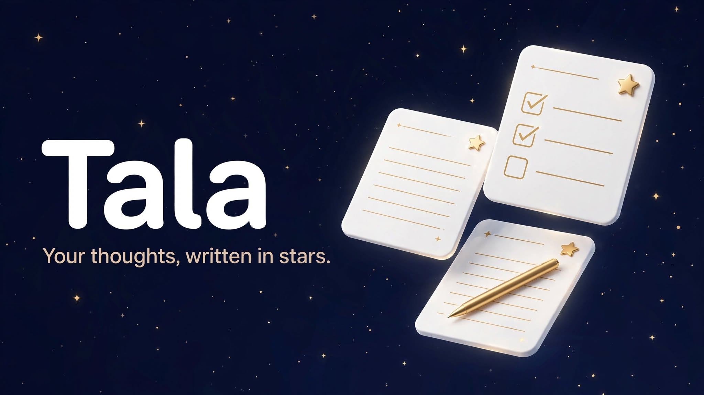
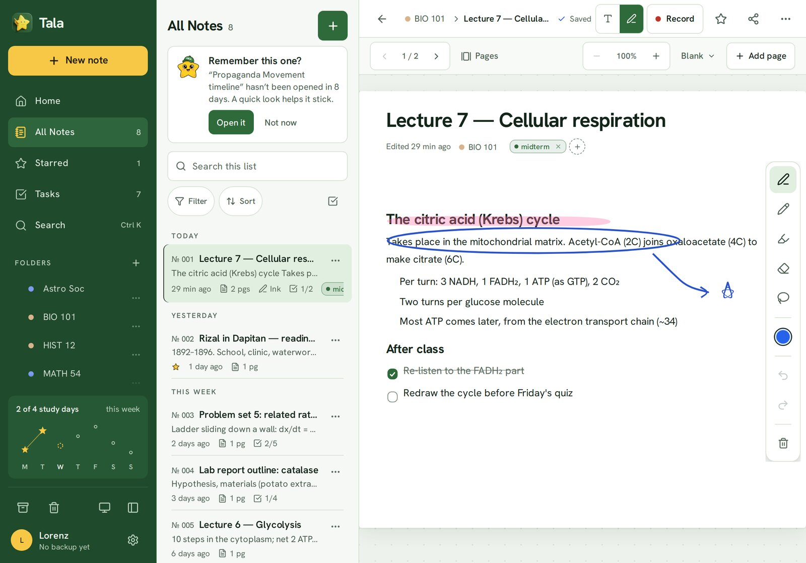
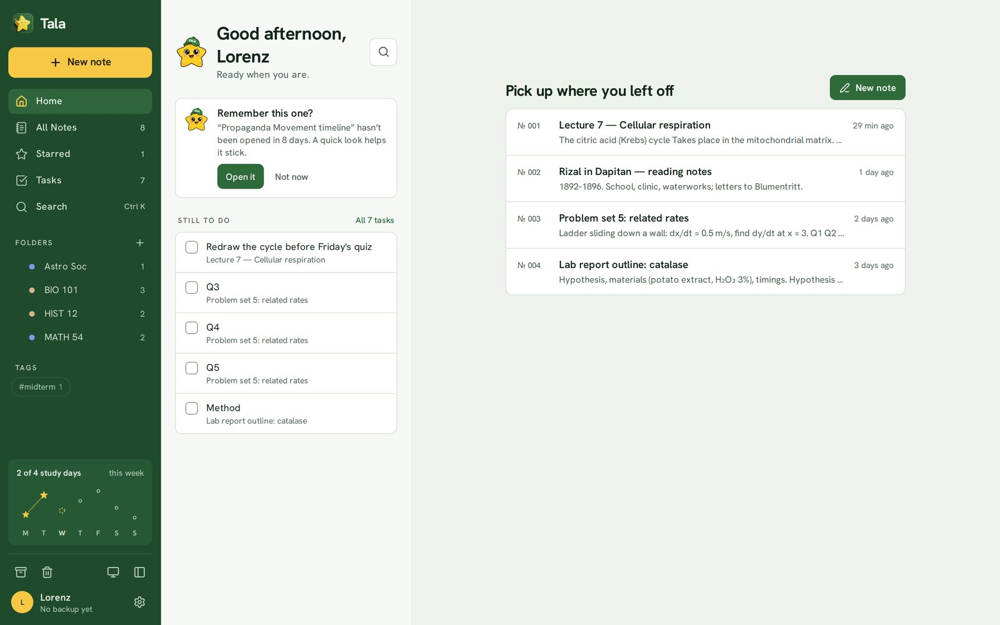

<p align="center">
  
</p>

<h1 align="center">Tala</h1>

<p align="center">
  <strong>Pagtatala, made simple.</strong><br/>
  A stylus-first, local-first notebook: typed notes, handwriting and PDF markup on the same pages.
</p>

<p align="center">
  <a href="https://tala.lorenzmalabanan.com/"><strong>Open Tala in your browser</strong></a> ·
  <a href="https://github.com/E1yWrites/tala/releases/latest">Windows download</a> ·
  <a href="CHANGELOG.md">Changelog</a>
</p>

<p align="center">
  <a href="https://github.com/E1yWrites/tala/releases/latest"></a>
  <a href="https://github.com/E1yWrites/tala/blob/main/LICENSE"></a>
  <a href="https://github.com/E1yWrites/tala"></a>
</p>

---

No account, no server, no tracking. Notes are stored on your device, work offline,
and leave it only when *you* export a backup. Install it as a web app on an iPad,
Android tablet or phone, or as a desktop app on Windows.

<p align="center">
  
</p>

## Get Tala

### Web app (iPad, Android, desktop browsers)

Open **[tala.lorenzmalabanan.com](https://tala.lorenzmalabanan.com/)**. After the first visit it works offline.

- **iPad / iPhone (Safari):** Share → Add to Home Screen. Safari can clear storage for sites that are not installed, so do this before you rely on it.
- **Android (Chrome):** menu → Install app.

### Windows

Installers are on the [latest release](https://github.com/E1yWrites/tala/releases/latest):

| Format | File | Best for |
| --- | --- | --- |
| .exe (NSIS) | `Tala_2.0.0_x64-setup.exe` | Standard Windows installer |
| .msi | `Tala_2.0.0_x64_en-US.msi` | Managed or silent install (`msiexec /i`) |

The installers are not code-signed. Each release has a `SHA256SUMS` file; check your download with:

```bash
sha256sum -c SHA256SUMS --ignore-missing
```

### Linux and macOS

No prebuilt installers. Build them with Tauri (see [Development](#development)), or use the web app.

---

## Features

- **Pages** — a note is an ordered stack of pages; each page owns its typed text and its handwriting. A page strip with thumbnails lets you jump and drag pages into a new order.
- **Type | Write** — one switch in the header. Typing is a Tiptap editor (headings, lists, task lists, quotes, code, links, images); writing puts the pen tools in a dock on the page's edge (a bottom row on phones). Switching never moves the text under your handwriting.
- **Handwriting** — pen, pencil, highlighter, eraser and a free-form lasso (recolour, duplicate). Pinch zoom and pan, a wet-ink pen with no visible lag, palm rejection while the pen is down, and left-handed mirroring.
- **Snap to shape** — rest the pen at the end of a stroke and a line, circle/ellipse, rectangle or triangle replaces it.
- **PDFs** — import keeps the original; pages render on demand, also offline. **Export annotated PDF** draws your ink as vectors over the original pages.
- **Lecture audio** — record while you write. Audio is saved in 5-second chunks, so a crash costs seconds, not the lecture; tap a stroke drawn while recording to hear the audio from just before it.
- **Bituin, the study coach** — a rule-based star mascot (no AI) with a weekly goal that never resets your progress, session wrap-ups, and nudges to reopen notes you haven't looked at in a week. Quiet mode silences it.
- **Home and the week** — the tasks still open across your notes, "Pick up where you left off", and a week constellation in the sidebar: one star per study day.
- **Organise** — folders, coloured tags, stars, pins, archive and trash with restore; catalogue numbers (№ 001, № 002, …) and lists grouped by day; a Tasks view across the library; instant search and a command palette.
- **Your data** — `.tala` backups (merge or replace; older `.json` backups still import), a weekly backup nudge, the share sheet on phones and tablets, and a safety copy of an older library before it is upgraded.
- **Built for tablet and desktop first** — colours from the app icon (forest-green sidebar, star-yellow New note, white pages on a light green dotted ground), dark mode to match, and a phone layout with a tab bar and 44 px touch targets.
- **Experimental, off by default** — handwriting search with the browser's built-in recogniser (ChromeOS and some Android; not iPad Safari).

<p align="center">
  
</p>

### Keyboard shortcuts

`Mod` is ⌘ on Mac and iPad, Ctrl elsewhere.

| Keys | Action |
| --- | --- |
| `Mod N` / `Alt N` | New note |
| `Mod K` / `Mod Shift F` | Search notes |
| `Mod Shift P` | Command palette |
| `Mod S` | Force save |
| `Mod B` | Show or hide the sidebar (bold while typing) |
| `Mod Shift D` | Toggle dark mode |
| `Mod ,` | Settings |
| `/` | Focus list search |
| `Esc` | Close dialog |

*(Some browsers reserve `Ctrl N`; use `Alt N` there.)*

---

## Development

```bash
git clone https://github.com/E1yWrites/tala.git
cd tala
npm install
npm run dev        # dev server, http://localhost:5173
npm run build      # typecheck + production build → dist/
npm run preview    # serve dist/, http://localhost:4173
npm run typecheck  # tsc --noEmit
npm test           # Vitest: migrations, write path, backups, canvas math, PDF export
```

`npm run test:smoke` and `npm run test:e2e` drive a real browser with Playwright against a running `npm run preview`.

### Desktop app (Tauri v2)

The same web app in a native shell (WebView2 on Windows, WebKitGTK on Linux; no bundled Chromium).
Notes live in the webview's IndexedDB under the `com.lanz.tala` identifier.

```bash
# one-time prerequisites (Debian/Ubuntu)
sudo apt install libwebkit2gtk-4.1-dev build-essential curl wget file \
  libxdo-dev libssl-dev libayatana-appindicator3-dev librsvg2-dev
curl --proto '=https' --tlsv1.2 -sSf https://sh.rustup.rs | sh

npm run app:dev     # native window (starts vite itself)
npm run app:build   # installers → src-tauri/target/release/bundle/
```

### Architecture

React 19 + Vite + Tiptap + Zustand, stored in IndexedDB with Dexie. No backend, no router.

```
src/
+-- library/      # the only code that writes note data: notes, pages, ink, PDFs,
|                 # recordings, backups, boot and migrations
+-- database/     # Dexie schema (v5, additive migrations from v2)
+-- canvas/       # zoom/pinch geometry, lasso, wet ink, snap-to-shape, thumbnails
+-- coach/        # Bituin's rules and copy
+-- components/   # NoteEditor (Tiptap + ink stack), NoteList, Sidebar, Modals, layout
+-- store/        # Zustand state (no actions; the library updates it)
+-- hooks/ utils/ types/
```

- **One writer.** Components call library functions; the library updates the stores optimistically, persists through one serialized queue, and rolls back with a toast if a write fails.
- **Scratch cards stay in memory.** A note with no title, text or ink is never written until it earns content.
- **PDFs keep their bytes.** Pages render from the original on demand; export copies the original pages and draws ink as vector paths in a worker.
- **Migrations are additive and tested** against seeded old databases; a pre-upgrade copy of the library is kept in a separate database.

See [CLAUDE.md](CLAUDE.md) for the detailed model (pages, ink keyed by page id, backups, lecture audio).

---

## License

[MIT](LICENSE) — (c) 2026 e1yu
